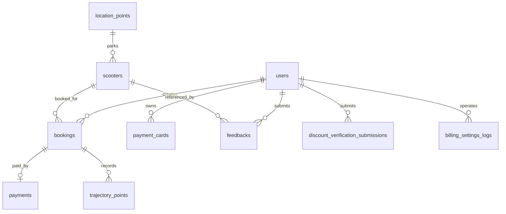

# 数据库结构说明

本文说明当前后端使用的数据库结构、表关系、关键状态值和初始化数据。数据库名称为 `scooter_db`，本地初始化入口是 `backend/init.sql`。

## 数据来源和同步规则

| 来源 | 作用 |
| --- | --- |
| `backend/init.sql` | 团队本地初始化脚本，创建数据库、表结构和演示车辆数据。 |
| `backend/src/main/java/com/group12/backend/entity/` | JPA 实体，是后端运行时业务字段的主要来源。 |
| `backend/src/main/java/com/group12/backend/repository/` | 每张业务表对应的数据访问入口。 |
| `backend/src/main/resources/application.yaml` | 默认 `spring.jpa.hibernate.ddl-auto=update`，启动应用时 Hibernate 可能补齐实体中存在但 SQL 脚本缺失的列或表。 |

维护原则：如果 `init.sql`、实体类和本文档不一致，应优先核对实体类和当前业务代码，再更新 `init.sql` 与本文档。

## 逻辑关系图

补充说明：

- `vehicle_descriptions.vehicle_type` 与 `scooters.type` 在业务值域上对应，但数据库没有外键。
- `audit_logs.user_id` 只保存用户 ID，不设置外键，避免审计记录因用户数据变化而丢失上下文。
- `billing_settings` 是单行配置表，业务上使用 `id = 1`。

## 表、实体和仓储对应

| 表 | 实体 | Repository | 业务职责 |
| --- | --- | --- | --- |
| `users` | `User.java` | `UserRepository.java` | 登录账号、角色、个人资料和折扣身份。 |
| `scooters` | `Scooter.java` | `ScooterRepository.java` | 车辆资产、车型、状态、位置、费率和用户端可见性。 |
| `location_points` | `LocationPoint.java` | `LocationPointRepository.java` | 固定站点或热点区域。 |
| `vehicle_descriptions` | `VehicleDescription.java` | `VehicleDescriptionRepository.java` | 车型展示文案和运营配置。 |
| `bookings` | `Booking.java` | `BookingRepository.java` | 预约订单、租期、状态、费用、折扣和起终点。 |
| `payments` | `Payment.java` | `PaymentRepository.java` | 订单支付流水。 |
| `payment_cards` | `PaymentCard.java` | `PaymentCardRepository.java` | 用户或 Guest 的支付卡脱敏信息。 |
| `trajectory_points` | `TrajectoryPoint.java` | `TrajectoryPointRepository.java` | 骑行 GPS 轨迹点。 |
| `billing_settings` | `BillingSettings.java` | `BillingSettingsRepository.java` | 当前计费、长租和折扣配置。 |
| `billing_settings_logs` | `BillingSettingsLog.java` | `BillingSettingsLogRepository.java` | 计费配置变更日志。 |
| `discount_verification_submissions` | `DiscountVerificationSubmission.java` | `DiscountVerificationSubmissionRepository.java` | 学生、老年折扣认证材料和审核状态。 |
| `feedbacks` | `Feedback.java` | `FeedbackRepository.java` | 用户反馈、优先级、升级处理和图片附件。 |
| `audit_logs` | `AuditLog.java` | `AuditLogRepository.java` | 关键操作审计日志。 |

## 核心表说明

### `users`

用途：保存系统用户，包括普通用户、店员和管理员。

| 字段 | 业务含义 |
| --- | --- |
| `id` | 用户主键。 |
| `email` | 登录邮箱，唯一。 |
| `password` | BCrypt 加密后的密码。 |
| `name` | 用户显示名。 |
| `role` | 用户角色，常见值为 `CUSTOMER`、`STAFF`、`ADMIN`。 |
| `is_student` | 是否学生，用于折扣判断。 |
| `age` | 年龄，用于老年折扣判断。 |

### `location_points`

用途：保存固定停车点或校园热点。

| 字段 | 业务含义 |
| --- | --- |
| `id` | 站点主键。 |
| `name` | 站点名称，例如 Library Plaza。 |
| `lat`、`lng` | 站点经纬度。 |

### `scooters`

用途：保存车辆资产、位置、费率和可见性。

| 字段 | 业务含义 |
| --- | --- |
| `id` | 车辆主键。 |
| `type` | 车型，种子数据包含 `GEN1`、`GEN2`、`GEN3`、`GEN3PRO`。 |
| `status` | 车辆状态，见“状态值速查”。 |
| `location_lat`、`location_lng` | 当前车辆坐标。 |
| `hour_rate` | 基础小时费率。 |
| `visible` | 是否对用户端可见，管理员可隐藏车辆。 |
| `location_point_id` | 外键，指向 `location_points.id`。 |

### `vehicle_descriptions`

用途：保存每种车型对外展示的文案，由管理端车型文案页面维护。

| 字段 | 业务含义 |
| --- | --- |
| `vehicle_type` | 车型唯一键，与 `scooters.type` 的业务值对应。 |
| `display_name` | 展示名称。 |
| `subtitle` | 副标题或型号补充。 |
| `description` | 车型描述。 |
| `range_text`、`speed_text`、`motor_text` | 续航、速度、电机展示文本。 |
| `advice` | 用车建议。 |

### `bookings`

用途：核心订单表，记录预约、支付、骑行和结算状态。

| 字段 | 业务含义 |
| --- | --- |
| `id` | 订单主键。 |
| `user_id` | 外键，指向下单用户。Guest 订单也会落到用户关联模型中。 |
| `scooter_id` | 外键，指向被预约车辆。 |
| `start_time`、`end_time` | 预约开始和结束时间。 |
| `duration_hours` | 租期小时数。 |
| `total_price` | 用户实际应付金额。 |
| `original_price` | 折扣前原价。 |
| `discount_amount` | 折扣金额。 |
| `discount_multiplier` | 折扣倍率。 |
| `discount_type` | 命中的折扣类型。 |
| `status` | 订单状态，见“状态值速查”。 |
| `payment_deadline` | 待支付订单的锁车截止时间。 |
| `start_lat`、`start_lng` | 开始骑行位置。 |
| `end_lat`、`end_lng` | 结束骑行位置。 |

### `payments`

用途：保存订单支付记录。

| 字段 | 业务含义 |
| --- | --- |
| `booking_id` | 外键，指向 `bookings.id`，并设置唯一约束，表示一张订单最多一条支付记录。 |
| `amount` | 支付金额。 |
| `payment_method` | 支付方式，例如 `CREDIT_CARD`。 |
| `timestamp` | 支付时间。 |

### `payment_cards`

用途：保存支付卡脱敏信息，支撑默认卡、支付门禁和 Guest 绑卡。

| 字段 | 业务含义 |
| --- | --- |
| `user_id` | 外键，指向卡片归属用户或 Guest 映射用户。 |
| `holder_name` | 持卡人姓名。 |
| `brand` | 卡品牌。 |
| `last4` | 卡号后四位。 |
| `expiry_month`、`expiry_year` | 有效期。 |
| `is_default` | 是否默认卡。 |
| `created_at` | 绑卡时间。 |

注意：当前 `PaymentCard.java` 定义了该实体，但 `backend/init.sql` 没有创建 `payment_cards` 表。依赖默认 `ddl-auto=update` 时，应用启动会由 Hibernate 创建；如果生产环境改为 `validate`，需要先补齐 SQL 迁移或手动建表。

### `trajectory_points`

用途：保存骑行轨迹点，供路线页回放。

| 字段 | 业务含义 |
| --- | --- |
| `booking_id` | 外键，指向订单。 |
| `lat`、`lng` | GPS 坐标。 |
| `recorded_at` | 采集时间。 |
| `seq` | 上传序号，用于排序和排查丢点。 |

### `billing_settings`

用途：保存当前生效的计费参数。业务上只使用 `id = 1` 一行。

| 字段 | 业务含义 |
| --- | --- |
| `long_rent_threshold_hours` | 长租阈值。 |
| `extra_long_rent_threshold_hours` | 超长租阈值。 |
| `long_rent_multiplier` | 长租小时费率倍率。 |
| `extra_long_rent_multiplier` | 超长租小时费率倍率。 |
| `student_discount_rate` | 学生折扣率，实体中存在。 |
| `senior_discount_rate` | 老年折扣率，实体中存在。 |
| `frequent_discount_rate` | 高频用户折扣率，实体中存在。 |
| `updated_at` | 最近更新时间。 |

注意：当前 `backend/init.sql` 只创建长租阈值、倍率和 `updated_at`，缺少实体中的三类折扣率列。依赖默认 `ddl-auto=update` 时会补列；如需严格 SQL 初始化，应补齐脚本。

### `billing_settings_logs`

用途：记录管理员修改计费配置的历史。

| 字段 | 业务含义 |
| --- | --- |
| `old_long_rent_multiplier`、`new_long_rent_multiplier` | 长租倍率变更前后值。 |
| `old_extra_long_rent_multiplier`、`new_extra_long_rent_multiplier` | 超长租倍率变更前后值。 |
| `operator_user_id` | 操作管理员用户 ID，可为空。 |
| `created_at` | 变更时间。 |

### `discount_verification_submissions`

用途：保存折扣认证申请和上传材料。

| 字段 | 业务含义 |
| --- | --- |
| `user_id` | 提交用户。 |
| `type` | 认证类型，当前支持 `STUDENT`、`SENIOR`。 |
| `status` | 审核状态。 |
| `storage_path` | 文件存储路径。 |
| `original_filename`、`mime_type`、`size_bytes` | 原始文件元数据。 |
| `submitted_at`、`reviewed_at` | 提交和审核时间。 |
| `reviewer_user_id` | 审核管理员。 |
| `reject_reason` | 驳回原因。 |
| `version` | 乐观锁版本。 |

### `feedbacks`

用途：保存用户反馈、图片附件和管理员处理结果。

| 字段 | 业务含义 |
| --- | --- |
| `user_id` | 提交用户，可为空。 |
| `scooter_id` | 关联车辆，可为空。 |
| `content` | 反馈内容。 |
| `priority` | 优先级，通常为 `LOW` 或 `HIGH`。 |
| `resolved` | 是否已解决。 |
| `escalated` | 是否升级。 |
| `escalated_to`、`escalated_at` | 升级目标和时间。 |
| `processed_by_user_id` | 处理人。 |
| `process_note` | 处理备注。 |
| `escalation_status` | 升级处理状态。 |
| `image_path`、`image_mime_type`、`image_size_bytes` | 反馈图片附件信息，实体中存在。 |

注意：当前 `backend/init.sql` 已包含升级处理字段，但缺少实体中的图片附件三列。依赖默认 `ddl-auto=update` 时会补列。

### `audit_logs`

用途：保存关键业务操作审计记录。

| 字段 | 业务含义 |
| --- | --- |
| `user_id` | 操作用户 ID，不设置外键。 |
| `action` | 操作名称，例如创建预约。 |
| `entity_name`、`entity_id` | 被操作实体类型和 ID。 |
| `request_params` | 请求参数快照。 |
| `timestamp` | 操作时间。 |

## 外键和索引

| 关系 | 说明 |
| --- | --- |
| `scooters.location_point_id -> location_points.id` | 车辆停放在某个站点。 |
| `bookings.user_id -> users.id` | 用户创建订单。 |
| `bookings.scooter_id -> scooters.id` | 订单绑定车辆。 |
| `payments.booking_id -> bookings.id` | 支付记录绑定订单，一对一。 |
| `trajectory_points.booking_id -> bookings.id` | 一个订单可有多条轨迹点。 |
| `feedbacks.user_id -> users.id` | 反馈提交人。 |
| `feedbacks.scooter_id -> scooters.id` | 反馈关联车辆。 |
| `feedbacks.processed_by_user_id -> users.id` | 反馈处理人。 |
| `discount_verification_submissions.user_id -> users.id` | 折扣认证提交人。 |
| `discount_verification_submissions.reviewer_user_id -> users.id` | 折扣认证审核人。 |
| `billing_settings_logs.operator_user_id -> users.id` | 计费配置修改人。 |

重要索引包括用户邮箱唯一索引、订单的用户/车辆索引、轨迹的订单索引、反馈的优先级和处理人索引、折扣认证的用户类型和状态类型索引。

## 状态值速查

| 字段 | 值 | 说明 |
| --- | --- | --- |
| `bookings.status` | `PENDING_PAYMENT` | 订单已创建但未支付，车辆临时锁定。 |
| `bookings.status` | `CONFIRMED` | 订单已确认，可骑行。 |
| `bookings.status` | `COMPLETED` | 订单已结束并结算。 |
| `bookings.status` | `CANCELLED` | 订单已取消或超时释放。 |
| `scooters.status` | `AVAILABLE` | 车辆可租。 |
| `scooters.status` | `RESERVED` | 车辆被待支付订单锁定。 |
| `scooters.status` | `RENTED` | 车辆正在租用。 |
| `scooters.status` | `MAINTENANCE` | 车辆维护中。 |
| `discount_verification_submissions.type` | `STUDENT`、`SENIOR` | 折扣认证类型。 |
| `discount_verification_submissions.status` | `PENDING`、`APPROVED`、`REJECTED` | 折扣审核状态。 |
| `feedbacks.priority` | `LOW`、`HIGH` | 反馈优先级。 |
| `feedbacks.escalation_status` | `PENDING`、`ESCALATED`、`DIRECT_HANDLED` | 高优反馈处理状态。 |

## 初始化数据

`backend/init.sql` 当前会写入：

- `vehicle_descriptions`：4 条车型展示文案，覆盖 `GEN1`、`GEN2`、`GEN3`、`GEN3PRO`。
- `location_points`：3 个演示站点，分别是 Library Plaza、Engineering Building、Student Union。
- `scooters`：5 辆演示车，包含 `AVAILABLE`、`MAINTENANCE`、`RENTED` 等状态。
- `billing_settings`：`id = 1` 的默认长租阈值和倍率。

脚本不插入默认用户。需要默认用户时，请通过应用注册，或手动插入 BCrypt 哈希后的密码。

## 当前不一致和后续修复建议

| 项 | 现状 | 风险 | 建议 |
| --- | --- | --- | --- |
| `payment_cards` | 实体和仓储存在，`init.sql` 未创建表。 | 生产若使用 `ddl-auto=validate` 会启动失败。 | 补充 SQL 建表语句和外键。 |
| `billing_settings` 折扣率列 | 实体包含 `student_discount_rate`、`senior_discount_rate`、`frequent_discount_rate`，`init.sql` 未创建。 | 纯 SQL 初始化后字段不完整。 | 在 `init.sql` 中补列并更新默认种子。 |
| `feedbacks` 图片列 | 实体包含 `image_path`、`image_mime_type`、`image_size_bytes`，`init.sql` 未创建。 | 上传反馈图片依赖 Hibernate 自动补列。 | 在 `init.sql` 中补列。 |
| 旧文档 | `backend/DATABASE_SCHEMA.md` 曾缺少轨迹、支付卡、折扣认证、计费配置等表。 | 新人读旧文档会误解当前结构。 | 旧文档应作为入口指向本文档。 |
| Schema 演进 | 当前没有 Flyway/Liquibase。 | 多人或生产环境更新结构时容易不一致。 | 如继续迭代，建议引入迁移脚本或维护一份严格同步的 SQL。 |

## 新人排查建议

1. 本地初次启动前执行 `backend/init.sql`。
2. 启动后端时保持默认 `ddl-auto=update`，让 Hibernate 补齐实体中新增字段。
3. 如果数据库报缺列或缺表，先对照本文“当前不一致”检查。
4. 如果生产环境使用 `validate`，必须先把 `init.sql` 或迁移脚本补齐到实体结构。
