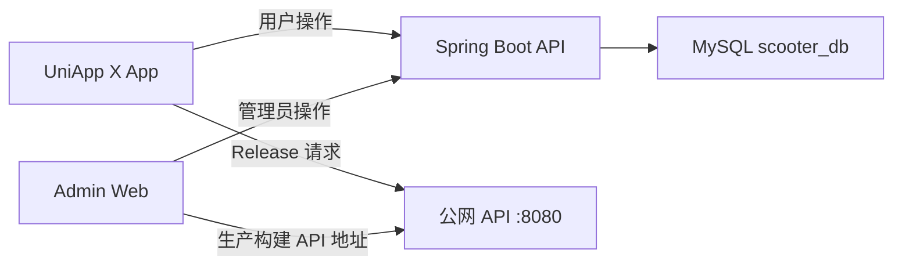
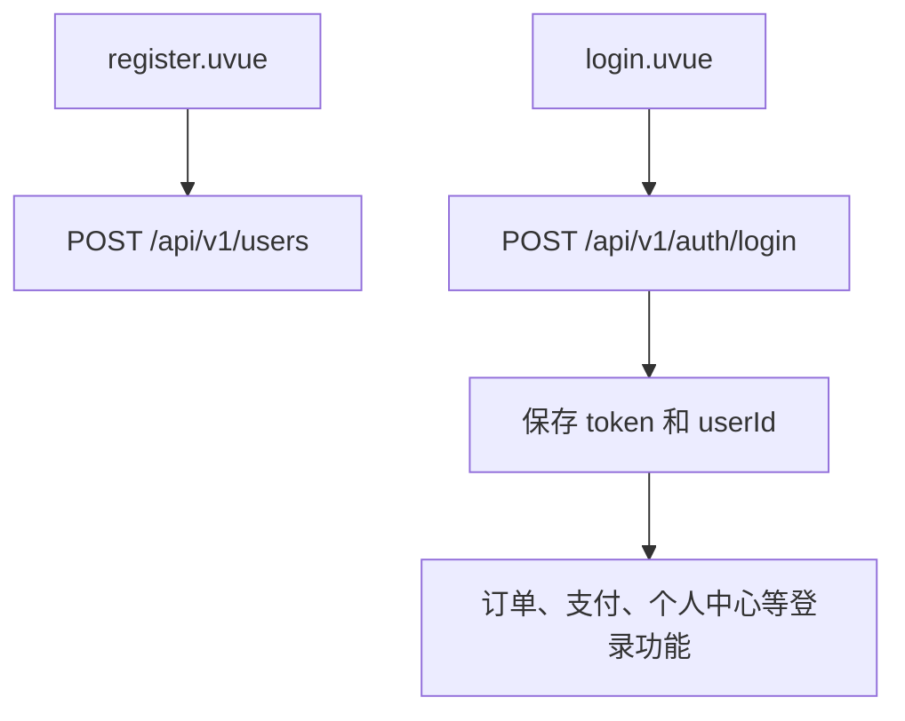
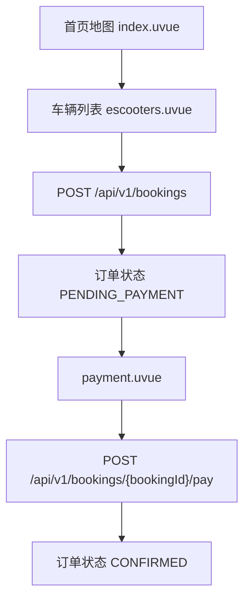
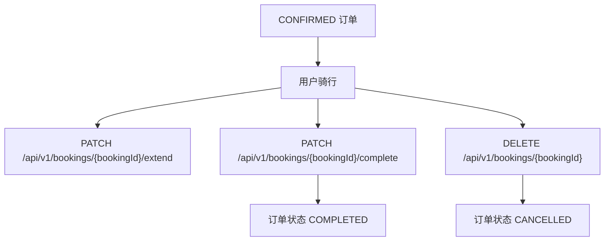
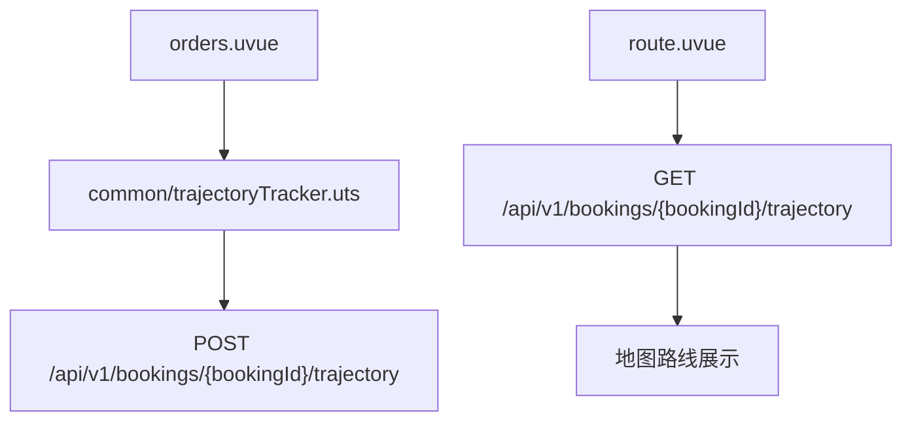
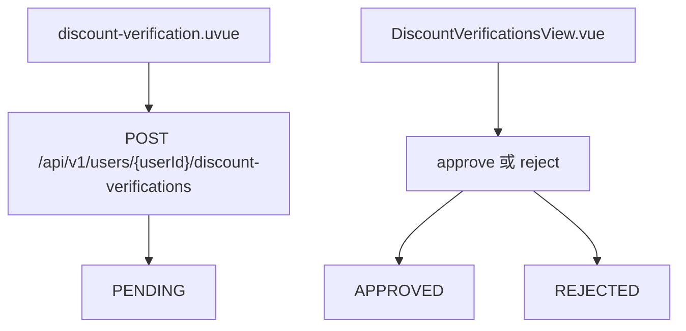
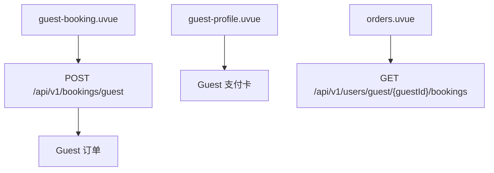

# 用户流程说明

本文按端到端业务流程说明移动端、管理端和后端 API 的协作关系。新人可以先读本文理解“用户怎么用系统”，再到 `docs/project-structure.md` 定位具体文件。

## 总览

核心角色：

- 普通用户：注册、登录、绑卡、找车、预约、支付、骑行、结束、反馈、提交折扣认证。
- 店员或工作人员：为 Guest 创建预约、维护 Guest 支付卡、查看 Guest 订单。
- 管理员：管理车辆、反馈、折扣审核、计费规则、营收分析和车型展示文案。

## 普通用户流程

### 1. 注册与登录

| 步骤 | 页面或模块 | 后端入口 | 说明 |
| --- | --- | --- | --- |
| 注册 | `pages/register/register.uvue` | `UserController` 的 `POST /api/v1/users` | 创建普通用户，密码由后端按 BCrypt 规则处理。 |
| 登录 | `pages/login/login.uvue` | `AuthController` 的 `POST /api/v1/auth/login` | 返回 token、用户 ID、角色等信息。 |
| 鉴权 | 页面请求封装 | `AuthenticationInterceptor` | 后端从 token 解析用户身份，保护需要登录的接口。 |

### 2. 找车、预约和支付

| 步骤 | 页面或模块 | 后端入口 | 状态变化 |
| --- | --- | --- | --- |
| 浏览车辆 | `pages/index/index.uvue`、`pages/escooters/escooters.uvue` | `ScooterController` 的 `GET /api/v1/scooters` | 只展示可见且可租的车辆。 |
| 查看位置 | 首页地图、车辆列表 | `GET /api/v1/scooters/{id}/location` | 读取车辆当前经纬度。 |
| 创建预约 | `pages/escooters/escooters.uvue` | `BookingController` 的 `POST /api/v1/bookings` | 创建 `PENDING_PAYMENT` 订单，并锁定车辆到支付截止时间。 |
| 支付订单 | `pages/payment/payment.uvue` | `POST /api/v1/bookings/{bookingId}/pay` | 支付后订单变为 `CONFIRMED`。 |
| 查询订单 | `pages/orders/orders.uvue` | `UserController` 的 `GET /api/v1/users/{userId}/bookings` | 用户查看自己的全部订单。 |

业务要点：

- `BookingServiceImpl` 是预约生命周期核心实现，负责创建、支付、取消、结束和价格结算。
- `BillingServiceImpl`、`DiscountServiceImpl` 和 `service/pricing/` 共同决定订单原价、折扣和最终价格。
- `BookingScheduler` 会定时处理超时未支付订单，释放车辆。

### 3. 骑行、延长和结束

| 动作 | 页面或模块 | 后端入口 | 说明 |
| --- | --- | --- | --- |
| 延长租期 | `pages/orders/orders.uvue` | `BookingExtensionController` 的 `PATCH /api/v1/bookings/{bookingId}/extend` | 校验订单状态、更新结束时间并重算费用。 |
| 结束骑行 | `pages/orders/orders.uvue` | `BookingController` 的 `PATCH /api/v1/bookings/{bookingId}/complete` | 可携带还车坐标，结算后释放车辆。 |
| 取消订单 | `pages/orders/orders.uvue` | `BookingController` 的 `DELETE /api/v1/bookings/{bookingId}` | 常用于待支付或未开始订单，释放车辆锁定。 |

### 4. 轨迹上传和路线查看

| 场景 | 文件 | 后端入口 | 说明 |
| --- | --- | --- | --- |
| 骑行中采集 | `common/trajectoryTracker.uts` | `TrajectoryController` 的 `POST /api/v1/bookings/{bookingId}/trajectory` | 按距离、时间和序号缓冲 GPS 点后批量上传。 |
| 查看路线 | `pages/orders/route.uvue` | `GET /api/v1/bookings/{bookingId}/trajectory` | 读取轨迹点并在地图上展示。 |

### 5. 支付卡管理

| 场景 | 页面 | 后端入口 |
| --- | --- | --- |
| 支付卡列表 | `pages/payment-card/payment-card.uvue`、`pages/payment/payment.uvue` | `GET /api/v1/users/{userId}/payment-cards` |
| 添加支付卡 | `pages/payment-card/payment-card-add.uvue` | `POST /api/v1/users/{userId}/payment-cards` |
| BIN 查询 | `pages/payment-card/payment-card-add.uvue` | `POST /api/v1/users/{userId}/payment-cards/bin-lookup` |
| 设置默认卡 | `pages/payment-card/payment-card.uvue` | `POST /api/v1/users/{userId}/payment-cards/{cardId}/default` |
| 删除支付卡 | `pages/payment-card/payment-card.uvue` | `DELETE /api/v1/users/{userId}/payment-cards/{cardId}` |

`PaymentCardServiceImpl` 负责卡片脱敏、默认卡切换、Guest 卡管理和支付门禁相关规则。

### 6. 折扣认证

| 角色 | 页面 | 后端入口 | 说明 |
| --- | --- | --- | --- |
| 用户 | `pages/discount-verification/discount-verification.uvue` | `DiscountVerificationController` | 提交学生或老年折扣材料，查看个人提交记录。 |
| 管理员 | `auth_web_front/src/views/admin/DiscountVerificationsView.vue` | `AdminDiscountVerificationController` | 查看待审材料、下载附件、批准或驳回。 |

支持的认证类型由 `DiscountVerificationConstants` 定义：`STUDENT`、`SENIOR`。状态为 `PENDING`、`APPROVED`、`REJECTED`。

### 7. 反馈提交和处理

| 阶段 | 页面或模块 | 后端入口 | 说明 |
| --- | --- | --- | --- |
| 用户提交反馈 | `pages/feedback/feedback.uvue` | `FeedbackController` 的 `POST /api/v1/feedbacks` | 提交文字、车辆 ID、优先级等信息。 |
| 上传图片 | `pages/feedback/feedback.uvue` | `PATCH /api/v1/feedbacks/{id}/image` | 图片由 `LocalFeedbackDocumentStorage` 保存。 |
| 管理员处理 | `FeedbacksView.vue`、`HighPriorityIssuesView.vue` | `GET /api/v1/feedbacks`、`PUT /api/v1/feedbacks/{feedbackId}`、`PUT /api/v1/feedbacks/{feedbackId}/process-priority` | 更新处理状态、直接处理或升级高优问题。 |
| 下载附件 | 管理端反馈页面 | `AdminFeedbackController` 的 `GET /api/v1/admin/feedbacks/{id}/file` | 管理员查看用户上传的反馈图片。 |

## Guest 与店员流程

### 1. 店员代客预约

| 步骤 | 页面或模块 | 后端入口 | 说明 |
| --- | --- | --- | --- |
| 创建 Guest 预约 | `pages/guest-booking/guest-booking.uvue` | `BookingController` 的 `POST /api/v1/bookings/guest` | 店员为未注册 Guest 选择车辆和时段。 |
| Guest 订单列表 | `pages/orders/orders.uvue` | `UserController` 的 `GET /api/v1/users/guest/{guestId}/bookings` | 店员通过 Guest ID 查看代客订单。 |
| Guest 支付卡 | `pages/guest-profile/guest-profile.uvue`、`pages/payment-card/payment-card-add.uvue` | `PaymentCardController` 的 Guest 路径 | 为 Guest 绑卡或查看 Guest 卡片。 |

## 管理员流程

### 1. 管理员登录和路由保护

| 文件 | 业务职责 |
| --- | --- |
| `auth_web_front/src/views/LoginView.vue` | 调用 `auth.ts` 登录，拿到 token 和角色。 |
| `auth_web_front/src/stores/auth.ts` | 保存 token、用户 ID、姓名和角色，判断 `isAdmin`。 |
| `auth_web_front/src/router/index.ts` | `/admin/*` 路由要求已登录且角色为 `ADMIN`。 |
| `backend/src/main/java/com/group12/backend/controller/AuthController.java` | 复用登录接口，返回管理员身份。 |

### 2. 车辆管理

| 管理动作 | 页面 | 后端入口 |
| --- | --- | --- |
| 查看全部车辆 | `auth_web_front/src/views/admin/ScootersView.vue` | `AdminController` 的 `GET /api/v1/admin/scooters` |
| 新增车辆 | `ScootersView.vue` | `POST /api/v1/admin/scooters` |
| 删除车辆 | `ScootersView.vue` | `DELETE /api/v1/admin/scooters/{id}` |
| 更新单车字段 | `ScootersView.vue` | `ScooterController` 的 `PUT /api/v1/scooters/{scooterId}` |
| 按车型批量预览和应用 | `ScootersView.vue` | `POST /api/v1/admin/scooters/bulk-by-type/preview`、`POST /api/v1/admin/scooters/bulk-by-type/apply` |

车辆状态主要包括 `AVAILABLE`、`RESERVED`、`RENTED`、`MAINTENANCE`。`visible` 控制车辆是否在用户端可见。

### 3. 反馈、高优问题和折扣审核

| 管理域 | 页面 | 后端入口 |
| --- | --- | --- |
| 普通反馈 | `auth_web_front/src/views/admin/FeedbacksView.vue` | `FeedbackController` 的管理员反馈接口 |
| 高优问题 | `auth_web_front/src/views/admin/HighPriorityIssuesView.vue` | `GET /api/v1/feedbacks/high-priority`、优先级处理接口 |
| 折扣审核 | `auth_web_front/src/views/admin/DiscountVerificationsView.vue` | `AdminDiscountVerificationController` |

### 4. 计费、营收和分析

| 管理域 | 页面 | 后端入口 | 说明 |
| --- | --- | --- | --- |
| 计费设置 | `auth_web_front/src/views/admin/BillingSettingsView.vue` | `GET/PUT /api/v1/admin/billing-settings` | 维护长租倍率和折扣率。 |
| 计费日志 | `BillingSettingsView.vue` | `GET /api/v1/admin/billing-settings/logs` | 查看配置变更历史。 |
| 营收统计 | `auth_web_front/src/views/admin/RevenueView.vue` | `GET /api/v1/admin/revenue` 等 | 查看收入、租期分布和趋势。 |
| 分析看板 | `auth_web_front/src/views/admin/AnalyticsView.vue` | `GET /api/v1/admin/dashboard/overview` | 查看运营概览。 |

### 5. 车型展示文案

| 页面 | 后端入口 | 说明 |
| --- | --- | --- |
| `auth_web_front/src/views/admin/VehicleContentEditorView.vue` | `VehicleDescriptionController` 的 `GET /api/v1/vehicles`、`PUT /api/v1/vehicles/{type}` | 管理员维护车型名称、副标题、续航、速度、电机和建议文案。 |
| `components/VehicleIntroOverlay/VehicleIntroOverlay.uvue` | `GET /api/v1/vehicles` | 用户端读取车型文案并展示。 |

## 常见状态速查

| 业务对象 | 状态值 | 说明 |
| --- | --- | --- |
| 订单 | `PENDING_PAYMENT` | 已创建但未支付，车辆临时锁定。 |
| 订单 | `CONFIRMED` | 已支付或确认，可骑行。 |
| 订单 | `COMPLETED` | 已结束并结算。 |
| 订单 | `CANCELLED` | 已取消或支付超时释放。 |
| 车辆 | `AVAILABLE` | 可租。 |
| 车辆 | `RESERVED` | 被待支付订单临时锁定。 |
| 车辆 | `RENTED` | 正在使用。 |
| 车辆 | `MAINTENANCE` | 维护中，不应被普通用户预约。 |
| 折扣审核 | `PENDING`、`APPROVED`、`REJECTED` | 用户提交材料后的审核状态。 |
| 反馈优先级 | `LOW`、`HIGH` | 普通反馈或高优先级问题。 |

## 阅读顺序建议

1. 先读本文理解业务流程。
2. 再读 `docs/project-structure.md` 找到对应页面、Controller、Service。
3. 需要联调数据库时读 `docs/database-structure.md`。
4. 需要上线时读 `docs/deployment-guide.md`。
